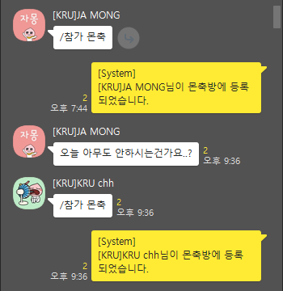
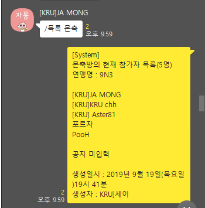

# 제작자 : [KRU] LohaasLove

### 명단 대표 관리 기능






#### 명단 관리 전체 명령어
```
[System]

===== 명령어 리스트 =====

----- 관리자를 포함한 모든 유저 -----
/참가,참여,지원 방이름
 -> 특정 몬축방 참여
 ex)/참가 몬축
 ex)/참여 몬축
 ex)/지원 몬축

/불참 방이름
 -> 특정 방 불참(지원한 몬축방에서 내 이름 빼기)
 ex)/불참 몬축

/목록
 -> 현재 진행 중인 모든 방 리스트 확인

/목록 방이름
 -> 특정 방의 참가자 리스트 확인
 ex)/목록 몬축

/체크
 -> 내가 참여하고 있는 모든 방 리스트 확인


----- 관리자 전용 명령어 -----
/생성 방이름 일시 연맹명
 -> 방 생성
 ex)/생성 몬축(방이름) 22시20분(일시) KRU(연맹명)

/수정,변경 방이름 바꿀방이름 바꿀일시 바꿀연맹명
 -> 방 수정 ex)/수정 몬축 5렙 22시 CRU

/제거,삭제 방이름
 -> 특정 방 제거
 ex)/제거 몬축
 ex)/삭제 몬축

/초기화,리셋
 -> 모든 방 제거
 ex)/초기화
 ex)/리셋

/마감 방이름
 -> 특정 방 참여제한
 ex)/마감 몬축

/마감해제 방이름
 -> 특정 방 참여제한 해제
 ex)/마감해제 몬축

/공지 방이름 내용
 -> 특정 방의 공지를 쓸 수 있음
 ex)/공지 몬축(방이름) 오늘내용은 이것저것 이고 이런거 유의해주세요.(내용) (내용부분은 띄워쓰기 가능)


도움말 : /? /help /도움말 /h

제작자 : 로하스러브(LohaasLove)

Latest Update Date : 2019.08.29
```

## 몬스터사냥 루틴 관리


#### 몬스터사냥 루틴 관리 전체 명령어
```
[System]

=====몬사 명령어 리스트 =====

----- R4, R5만 가능. 관리자 필요시 말씀주세요 -----


----- 몬사 인원 뽑기, 인증, 공지관련 -----
/몬사,ㅁㅅ 공지
 -> 몬사 공지출력
 ex)/몬사 공지

/몬사,ㅁㅅ 공지등록
 -> 몬사 공지등록
 ex)/몬사 공지등록 내용

/몬사,ㅁㅅ 링크등록
 -> 몬사 인증링크등록
 ex)/몬사 링크등록 http://abceg.co.kr

/몬사,ㅁㅅ 포인트등록
 -> 몬사 인증포인트등록
 ex)/몬사 포인트등록 15

/몬사,ㅁㅅ 뽑기 인원수
 -> 몬사 인원 뽑기
 ex)/몬사 뽑기 5

/몬사,ㅁㅅ [오늘 | 누구]
 -> 오늘의 몬사인원 출력
 ex)/몬사 오늘
 ex)/몬사 누구

/몬사,ㅁㅅ 인증 id
 -> 몬사 완료 시 id로 인증. 인증 횟수를 1 증가, 일시등록o
 ex)/몬사 인증 46

/몬사,ㅁㅅ 미인증 id
 -> 몬사 완료 시 id로 미인증. 인증 횟수를 1 감소, 경고 1증가, 일시등록x
 ex)/몬사 미인증 47


----- 연맹원 리스트 관리 -----
/몬사,ㅁㅅ 추가,등록 이름
 -> 몬사 테이블에 연맹원 추가
 ex)/몬사 추가 KRU Say
 ex)/ㅁㅅ 등록 LohaasLove

/몬사,ㅁㅅ 목록 [옵션(필요시-정렬기준)]
 -> option : id,아이디 / 이름 / 횟수 / 날짜 / 경고
 ex)/몬사 목록
 ex)/ㅁㅅ 목록 이름
 ex)/ㅁㅅ 목록 경고

/몬사,ㅁㅅ 수정 id 이름 바꿀이름
 -> 연맹원의 id로 이름 변경
 ex)/몬사 수정 3 이름 KRUSAY
 ex)/ㅁㅅ 수정 6 이름 LOHAAS

/몬사,ㅁㅅ 수정 경고 바꿀경고횟수
 -> 연맹원의 id로 경고횟수 변경
 ex)/몬사 수정 3 경고 2
 ex)/ㅁㅅ 수정 6 경고 1

/몬사,ㅁㅅ 삭제 id
 -> 연맹원의 id로 해당 연맹원 삭제
 ex)/몬사 삭제 3
 ex)/ㅁㅅ 삭제 8

제작자 : 로하스러브(LohaasLove)

Latest Update Date : 2019.09.01
```
